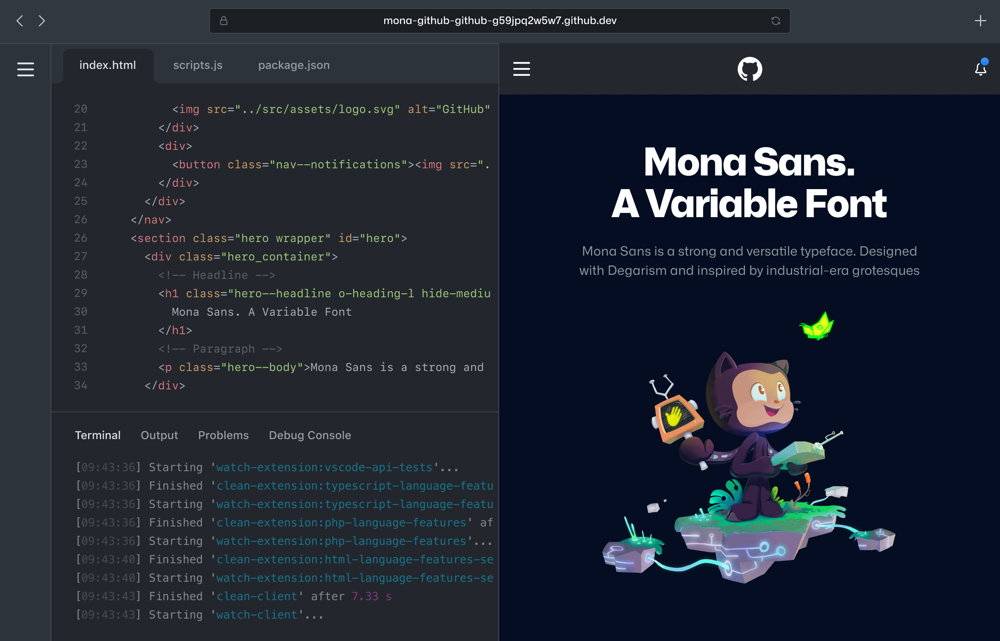

## Setup Process

In a typical project the first step is to setup your development environment, install all the necessary dependencies and libraries, and run a few scripts. This setup can often take a few hours... if not days.

Thanks to Codespaces your development environment has already been set up and configured for you. You can jump into the project and start working with Actions right away!

