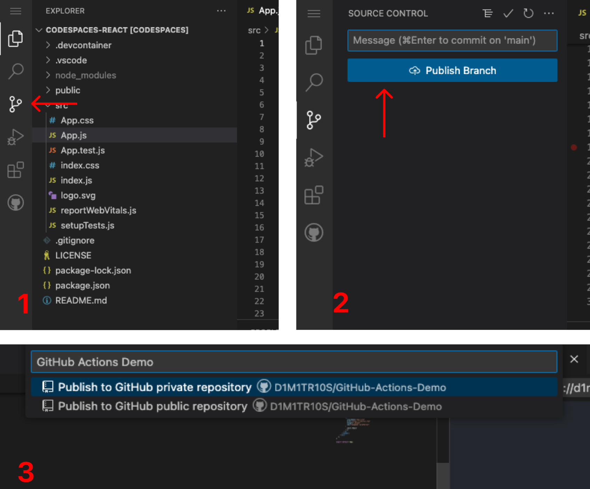

<h1>Publish your project to GitHub</h1>

<h3>For GitHub Actions to work your project needs to be connected to a GitHub repository.

Since we're starting from a Codespace, you'll need to publish this project to your GitHub account.

1. Click the "Source Control" button in your sidebar
2. Click the "Publish Branch" button.
3. Name your repository and hit "Enter".

_Important: Make sure to publish the project as a “public repository” if you don’t want to use your monthly Actions minutes._</h3>

<h3>Awesome! Now your project is now live in GitHub. 🎉 </h3>