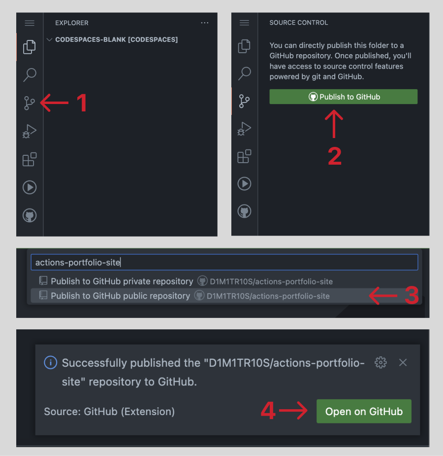

#

## Publishing your Project to GitHub

For GitHub Actions to work your project needs to be connected to a GitHub repository. To do this from a Codespace, you'll need to publish this project to your GitHub account.

1. Click the "Source Control" button in your sidebar
2. Click the "Publish Branch" button.
3. Name your repository and hit "Enter".

Awesome! Now your project is now live in GitHub. 🎉