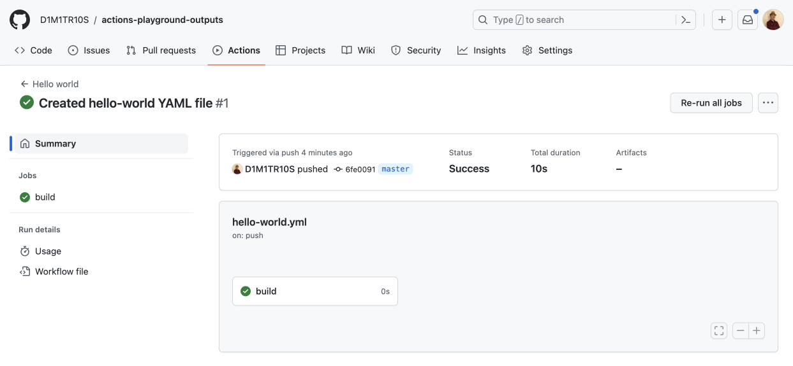
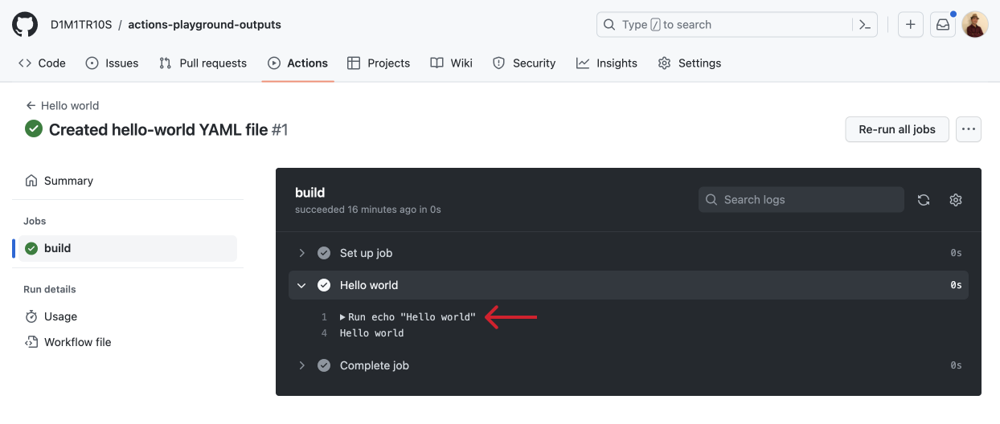

<h1>Viewing the output of workflow runs</h1>

<h3>

1. Click the "Open in GitHub" button in the notification on the bottom right of your codespace. This will take you to the Actions tab in your repo. Here you'll see a list of all the workflow runs in that repo.
    

2. Click the workflow run to view it's job summary. _It's title will be the message on your last commit, or "Hello World" (the name you gave the workflow) if there was no commit message._
    

3. On the workflow run page, you can view the following information:

    - Workflow: The name of the workflow that was run.
    - Trigger Event: The event that triggered the workflow (e.g. push, pull request).
    - Commit: The commit associated with the event.
    - Status: The status of the workflow run (e.g. success, failure).
    - Duration: The amount of time it took for the workflow to run.
    - Artifacts: Any files created by the workflow run
    - Jobs: A list of the jobs that were run as part of the workflow and each one's status.

    

4. To view the output of a specific job, click on the job in the list on the left side-bar or in the pipeline visualizer. This will show you the steps that were run as part of the job, along with their output and duration.
    

5. To view the output of a specific step, click on the step in the list. This will show you the output of the step, including any log messages or error messages that were generated.
    
    
    

By reviewing the output of workflow runs, you can understand what actions were taken as part of the workflow, and any errors or bugs that were caught by that workflow run. This is helpful for debugging errors in your code.
</h3>

<h2>"Run Details" section</h2>
<h3>An overview of the run, including the event that triggered the run, the repo and branch where the run occurred, the status of the run (success, failure, or error), and the date and time when the run began and ended. It also has tab section to show the logs of the steps, any environment variables, and the job's result.</h3>

<h2>"Usage" section</h2>
<h3>Shows the resources used by the run, including the number of CPU cores and memory used, as well as the total duration of the run. This can be useful for monitoring resource usage, especially when debugging performance issues.</h3>

<h2>"Workflow files" section</h2>
<h3>Shows the workflow file that was used to configure the run, as well as any other files referenced by the workflow. It's a great way to review the configuration of, or make a quick edits to, the workflow file.</h3>