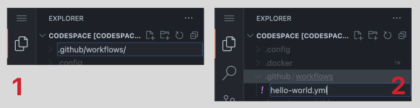
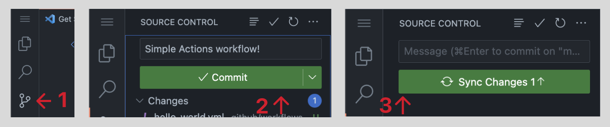

<h1>Creating your first Actions workflow</h1>

<h3>
GitHub Actions uses the YAML scripting language for defining workflows.

We'll start by writing a simple workflow that prints "Hello World" into the console every time someone pushes code to the repository.</h3>
<h2>To build this workflow:</h2>
<h3>

1. Create a folder in your root directory called “.github/workflows/
    _For Actions to work, your YAML files need to be in the “.github/workflows/” folder._

2. Create a file named “hello-world.yml”

    

3. Paste this code into the “hello-world.yml” file
    ```yml
    name: Hello world

    on: [push]

    jobs:
      build:
        runs-on: ubuntu-latest
        steps:
        - name: Hello world
          run: |
            echo "Hello world"
    ```

4. Push your changes to the repository

    
    _The push event will trigger the workflow run, printing "Hello World" to the Actions output._

5. Open the job summary for your workflow run to see “Hello World” in the console.</h3>


<h2>YAML File Components</h2>
<br>

`on:`
<h3>Specifies which events will trigger the workflow. You can specify one or more trigger events. Trigger events can be anything from a Pull Request to a new issue being created. You can even trigger workflows manually, on a specified schedule, or from an external event outside of GitHub(via API).</h3>

`jobs:`
<h3>Defines a set of tasks to be executed. Jobs are defined by a key (the name of the job) and the value (the details of the job). In this example, the job will run a single step that uses the echo command to print "Hello World" to the console. You can define multiple jobs in a single workflow, and each job can have multiple steps. Jobs can also depend on other jobs, allowing you to define complex workflows with multiple consecutive tasks.</h3>

`build:`
<h3>This is the name of that specific job. A job is a named set of steps that define the work that needs to be done as part of a workflow. You can change the name of this job and it will still work.</h3>

`runs-on:`
<h3>This defines the job’s “runners”. A runner is an execution environment that runs your workflow’s jobs. In this case, it’s the standard 2-core Ubuntu virtual machine hosted by GitHub. GitHub also offers 3-core macOS runners and various sizes of VMs (from 4 to 64 cores) for Linux and Windows. When you create a workflow, you can specify which type of runner a job will use in the `runs-on` field.</h3>

`steps:`
<h3>The value of the "steps" key is a list of objects, where each object defines a single action and its properties. Each task is represented by a "step" and is defined using a “- ” followed by a block of YAML that specifies the task to be performed.</h3>

`- run:`
<h3>This tells you what command to run. Here, we run the echo command to print "Hello World" to the console. You can run any command that is available on the runner operating system. These could be shell commands, scripts, or executables.

For example, you can use `- run: ls` to list the files in the current directory, `- run: ./my-script.sh` to run a shell script.

You can run multiple commands in a single `- run:` step by separating them with “&&”. For example, `- run: command1 && command2` would run command1 followed by command2.

Keep in mind that the `- run:` step will only succeed if the command returns an exit code of 0. If the command returns a non-zero exit code, the step will be considered a failure.</h3>

<details>
<summary><h2>Breakdown of YAML syntax</h2></summary>
<h3>YAML (short for “Yet Another Markup Language”) is a human-readable data serialization language that is used for storing and transmitting data structures and configurations. It is often used for configuration files, but can also be used for storing data in a serialized form, such as database dumps or log files.

**Some basic rules for YAML syntax in GitHub Actions:**

- Indentation & Spaces: YAML files use indentation to indicate structure, with each level of indentation representing a new level in the hierarchy. You indent with spaces (NOT TABS). In addition, there MUST be spaces between element parts.
[Code block example]
✅ For example, this syntax will work: “Key: Value”
⛔ But this will fail: “Key:Value”. (Because there’s no space after the colon)
- Key-Value Pairs: YAML files use key-value pairs to represent data. The key is on the left side of the colon, and the value is on the right. Here are some examples:
[Code block example]
> - key: value
> - number: 299
> - quoted-string: "some text description"
> - unquoted-string: strings do not have to be quoted, but I recommend using quotes for readability
> - boolean: true
> - keys can have species in them: and so can values
> - null-key-value: null
- Quotes: String values do not need to be quoted, unless they contain special characters or if the value starts with certain characters (such as @, %, or ``). In these cases, single or double quotes can be used to enclose the value.
- Lists & Collections: Lists and collections are represented by a hyphen followed by a space(“- ”) and can contain multiple items. Each item in the list must be indented at the same level.
[Code block example]
- Dictionaries: Dictionaries (also known as maps or associative arrays) are represented by a key followed by a colon and a value, with each key-value pair being indented at the same level.
[Code block example]
- Begin/End document: Defining the start and end of a document is optional. To start a document insert '---' at the top of the document, to end it, insert '...'
Comments: Comments are defined with a hash (“#”) before the comment’s text
[Code block example]
\# this is a comment\<br />
- Key: Value #this another comment

</details>
