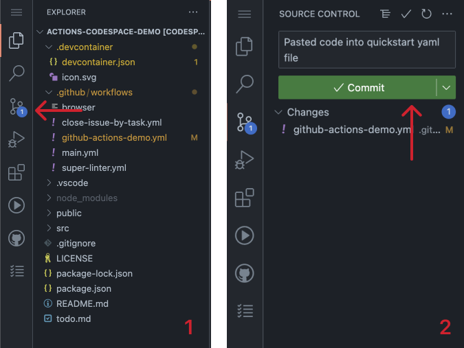

#

## Pushing your changes to GitHub

Now that your YAML file has been created, let's push your changes to the GitHub repository

1. Click the Source Control icon in VS Code's sidebar.
2. Click the "Commit" button, add a commit message, and push your changes to the repository.

