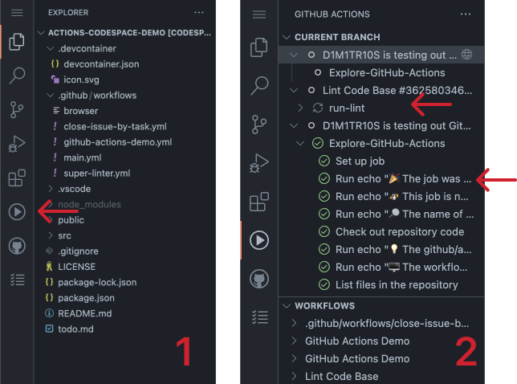
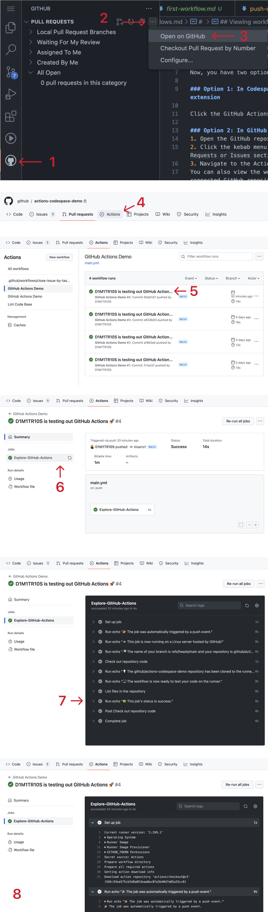

#

## Viewing workflow runs and results

Pushing the changes to your repository will have triggered the workflow to run via the "push" trigger event specified in the YAML file.

To view the workflows running in real-time, you have two options:

### 1: In Codespaces (or VS Code) with the GitHub Actions extension

1. Click the GitHub Actions icon that looks like a play button
2. Under "Current Branch" you'll see all of your workflows that are currently running and completed.
3. Click on any of the rows under a dropdown row. Each nested row is a job run within that workflow.
4. Click on one of the nested rows to view the log files for that job run.

### 2: In GitHub, under the Actions tab
1. Open the GitHub repository by clicking the GitHub extension icon
2. Click the kebab menu (3 dots) at the top right of the Pull Requests or Issues section.
3. Navigate to the Actions tab
4. View workflow runs
5. Click on the most recent run to view the job summary, pipeline visualizer, and log files

